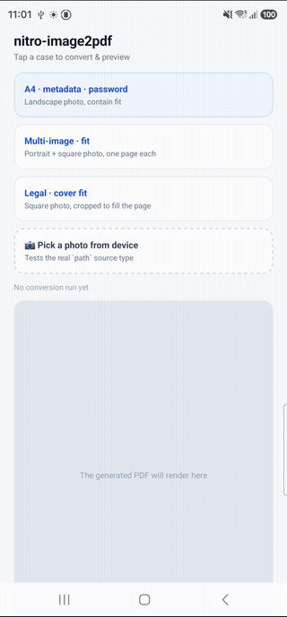
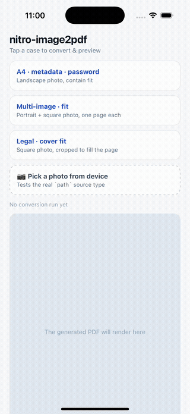

<div align="center">

# 📄 React Native Nitro Image to PDF

**Convert images (local paths, `content://` URIs, remote URLs, or raw base64) into a single PDF — built on [Nitro Modules](https://nitro.margelo.com/) for full type safety and JSI performance, no bridge, no serialization overhead**

[](https://www.npmjs.com/package/react-native-nitro-image2pdf) [](https://www.npmjs.com/package/react-native-nitro-image2pdf) [](https://github.com/lehoi2195/react-native-nitro-image2pdf/blob/main/LICENSE) [](https://www.typescriptlang.org/)

[](https://reactnative.dev/) [](https://reactnative.dev/) [](https://reactnative.dev/architecture/landing-page)

</div>

## 🎬 Demo

<p align="left">
  
  
</p>

## 📑 Contents

- [✨ Features](#-features)
- [📋 Requirements](#requirements)
- [📦 Installation](#installation)
- [🚀 Usage](#usage)
- [🏃 Running the example app](#running-the-example-app)
- [📚 Options reference](#options-reference)
- [🔐 Encryption (per-platform)](#encryption-per-platform--not-aes-parity)
- [📁 Output directory mapping](#output-directory-mapping)
- [🛡️ Android: R8 / ProGuard keep rules](#android-r8--proguard-keep-rules)
- [🔄 Migration from react-native-image-to-pdf](#migration-from-react-native-image-to-pdf)
- [⚠️ Error handling](#error-handling)
- [🙏 Credits](#credits)
- [🤝 Contributing](#contributing)

## ✨ Features

- 📄 **Single call, multi-image → one PDF** — `path`, `content://`, remote `http(s)://`, or raw base64 sources, mixed freely in one document
- 📐 **Flexible page layout** — `A4`/`A5`/`Letter`/`Legal`/custom sizes or fit-to-image, with `contain`/`cover`/`stretch` fitting, margins, and background color
- 🗜️ **Resize & compress before drawing** — `maxWidth`/`maxHeight` downsampling and JPEG `quality` re-encoding, consistent on both platforms
- 🔒 **Password protection** — open (user) and permissions (owner) passwords, AES on Android / RC4 on iOS
- 🏷️ **Document metadata** — title, author, subject, keywords, creator
- 📤 **Flexible output** — write to disk (`cache`/`documents`/`temp`/absolute path), return base64, or both
- ⚡ **JSI-backed, type-safe bindings** via [Nitro Modules](https://nitro.margelo.com/) (New Architecture only, no legacy bridge)

## Requirements

> [!IMPORTANT]
> This package requires React Native's **New Architecture**. Nitro Modules do not support the
> legacy bridge, so there is no old-architecture fallback.

- React Native **v0.76.0** or higher, with the New Architecture enabled
- `react-native-nitro-modules` **v0.36.1** or higher
- Node 18.0.0 or higher

## Installation

```bash
npm install react-native-nitro-image2pdf react-native-nitro-modules
```

`react-native-nitro-modules` is a required peer dependency (Nitro's JSI runtime) — it must be
installed alongside this package.

## Usage

```ts
import { createPdf } from 'react-native-nitro-image2pdf'

const result = await createPdf({
  images: [
    { type: 'path', value: '/path/to/photo1.jpg' },
    { type: 'uri', value: 'https://example.com/photo2.jpg' },
    { type: 'base64', value: rawBase64String },
  ],
  page: {
    size: 'A4',
    fitMode: 'contain',
    margin: 24,
    backgroundColor: '#FFFFFF',
  },
  processing: {
    maxWidth: 2000,
    quality: 0.8,
  },
  output: {
    directory: 'documents',
    fileName: 'invoice',
    format: 'both',
  },
  metadata: {
    title: 'Invoice',
    author: 'My App',
  },
  security: {
    password: '1234',
  },
})

console.log(result.filePath)       // e.g. file:///.../invoice.pdf
console.log(result.numberOfPages)  // 3
console.log(result.fileSize)       // bytes on disk
console.log(result.pages)          // [{ width, height }, ...] per page, in points
// result.base64 is also populated because output.format === 'both'
```

A minimal call with all defaults applied:

```ts
import { createPdf } from 'react-native-nitro-image2pdf'

const { filePath } = await createPdf({
  images: [{ type: 'path', value: localImagePath }],
})
```

A runnable example screen lives in [`example/App.tsx`](./example/App.tsx).

## Running the example app

The `example/` app (demo above) exercises every image source, page/fit combination, password
protection, and an inline PDF preview via `react-native-pdf`, plus a device photo picker.

```bash
git clone https://github.com/lehoi2195/react-native-nitro-image2pdf
cd react-native-nitro-image2pdf
npm install                       # installs root + example (npm workspaces)
cd example/ios && pod install && cd ../..

npm run start --workspace=example    # Metro, in one terminal
npm run android --workspace=example  # or: npm run ios --workspace=example
```

You'll need a real or emulated device with the Android/iOS toolchains set up as usual for React
Native with the New Architecture enabled.

## Options reference

### `CreatePdfOptions`

| Field | Type | Required | Notes |
|---|---|---|---|
| `images` | `ImageInput[]` | Yes | Non-empty. See [Image sources](#image-sources). |
| `page` | `PageConfig` | No | See below. Omit for `size: 'fit'` behavior. |
| `processing` | `ProcessingConfig` | No | Resize / re-encode before drawing into the PDF. |
| `output` | `OutputConfig` | No | Where and how the PDF is returned. |
| `metadata` | `PdfMetadata` | No | Written to the PDF's document info dictionary. |
| `security` | `SecurityConfig` | No | Password-protects the PDF. See [Encryption](#encryption-per-platform---not-aes-parity). |

### Image sources

| `type` | `value` | Behavior |
|---|---|---|
| `path` | Local file path, `file://`, or (Android) `content://` URI | Read directly from disk / `ContentResolver`. |
| `uri` | Remote `http(s)://` URL | Downloaded on a background thread with a timeout. |
| `base64` | Raw base64 string (**no** `data:` prefix) | Decoded natively. |

### `PageConfig`

| Field | Type | Default | Notes |
|---|---|---|---|
| `size` | `'fit' \| 'A4' \| 'A5' \| 'Letter' \| 'Legal' \| 'custom'` | `'fit'` | `'fit'` makes each page match its image's own dimensions (legacy behavior). |
| `customWidth` | `number` (points) | — | Required when `size === 'custom'`, must be `> 0`. |
| `customHeight` | `number` (points) | — | Required when `size === 'custom'`, must be `> 0`. |
| `fitMode` | `'contain' \| 'cover' \| 'stretch'` | `'contain'` | Ignored when `size === 'fit'`. `'cover'` clips to the page's content rect. |
| `margin` | `number` (points) | `0` | Must be `>= 0`. |
| `backgroundColor` | `string` (`'#RRGGBB'`) | white | Filled behind the image before drawing (visible with `margin` or letterboxing from `'contain'`). |

### `ProcessingConfig`

| Field | Type | Default | Notes |
|---|---|---|---|
| `maxWidth` | `number` | — | Downscale images wider than this before drawing (both platforms: Android via decode-time `inSampleSize`, iOS via `CGImageSourceCreateThumbnailAtIndex`). Must be `> 0`. |
| `maxHeight` | `number` | — | Downscale images taller than this before drawing (both platforms). Must be `> 0`. |
| `quality` | `number` (`0`–`1`) | `1` | JPEG re-encode quality — re-compresses each image as JPEG before drawing (both platforms: `JPEGFactory` on Android, `UIImage.jpegData(compressionQuality:)` on iOS). `1` skips re-encoding entirely (no compression, original quality). |

`maxWidth`/`maxHeight`/`quality` all reduce PDF file size for large source images and now behave consistently on both platforms.

### `OutputConfig`

| Field | Type | Default | Notes |
|---|---|---|---|
| `directory` | `'cache' \| 'documents' \| 'temp'` | `'cache'` | Ignored when `absolutePath` is set. See [directory mapping](#output-directory-mapping). |
| `fileName` | `string` | UUID-based, auto-generated | An existing file with the same name is **overwritten**. |
| `absolutePath` | `string` | — | Full path override. Parent directory must already exist and be app-writable. Overwrites on collision. |
| `format` | `'file' \| 'base64' \| 'both'` | `'file'` | Controls which of `result.filePath` / `result.base64` is populated. |

### `PdfMetadata`

| Field | Type |
|---|---|
| `title` | `string` |
| `author` | `string` |
| `subject` | `string` |
| `keywords` | `string` |
| `creator` | `string` |

### `SecurityConfig`

| Field | Type | Notes |
|---|---|---|
| `password` | `string` | Open (user) password. Empty string is rejected by validation. |
| `ownerPassword` | `string` | Permissions password — encrypts the PDF even if `password` is not set. Owner-password-only encryption applies platform-default permission restrictions (see source for the exact policy currently in effect on each platform). |

### `CreatePdfResult`

| Field | Type | Notes |
|---|---|---|
| `filePath` | `string?` | Present when `format` is `'file'` or `'both'`. |
| `base64` | `string?` | Present when `format` is `'base64'` or `'both'`. |
| `numberOfPages` | `number` | |
| `fileSize` | `number?` | On-disk PDF size in bytes; `undefined` when `format === 'base64'`. |
| `pages` | `PdfPageInfo[]` | `{ width, height }` per page, in points. |

## Encryption (per-platform — not AES parity)

Password protection uses a **different algorithm on each platform**. This is a deliberate,
documented trade-off, not a bug:

| Platform | Engine | Algorithm | Max strength |
|---|---|---|---|
| iOS | Core Graphics (`kCGPDFContextUserPassword` / `OwnerPassword`) | **RC4** (Standard Security Handler) | 128-bit |
| Android | PdfBox-Android (`StandardProtectionPolicy`) | **AES** | 128-bit (AES-256 is not supported for writing on either platform) |

Both platforms gate opening the file behind the password; the strength/algorithm differs.
Empty-string passwords are rejected during validation. Setting only `ownerPassword` still encrypts
the file even without a `password`; the resulting permission restrictions (printing/copying/
modification) follow each platform's default permission policy — see `PdfBuilder.swift` /
`PdfBuilder.kt` for the exact policy currently in effect, as it may not perfectly match your
expectations of a fully locked-down document.

## Output directory mapping

| `directory` | iOS | Android |
|---|---|---|
| `cache` | `NSCachesDirectory` | `context.cacheDir` |
| `documents` | `NSDocumentDirectory` | `context.filesDir` |
| `temp` | `NSTemporaryDirectory()` | `context.cacheDir` (⚠ same physical directory as `cache` on Android) |

On iOS, `cache`/`documents`/`temp` all resolve to three distinct directories. On Android, `temp`
intentionally maps to the same directory as `cache` (Android has no separate app-scoped temp
directory equivalent to iOS's).

## Android: R8 / ProGuard keep rules

PdfBox-Android uses BouncyCastle via reflection for AES-128 encryption, and PdfBox's own
resource/font subsystem also relies on reflection. **Minified (R8/ProGuard) release builds that use
`security.password` / `security.ownerPassword` will crash at runtime without these keep rules.**
They are shipped with this package via `consumerProguardFiles`, so consuming apps do not need to add
them manually — they're documented here for visibility and in case you need to customize your own
ProGuard configuration:

```proguard
# PdfBox-Android uses BouncyCastle via reflection for AES-128 encryption
# (StandardProtectionPolicy). Without these keep rules, minified release
# builds crash at runtime when `security.password`/`ownerPassword` is set.
-keep class org.bouncycastle.** { *; }
-dontwarn org.bouncycastle.**

# PdfBox-Android's own resource/font subsystem also relies on reflection.
-keep class com.tom_roush.pdfbox.** { *; }
-keep class com.tom_roush.fontbox.** { *; }
-dontwarn com.tom_roush.**
```

> **Note:** these rules have not yet been verified against an actual minified release build with
> encryption enabled end-to-end. If you hit a `ClassNotFoundException` or similar reflection error
> in a minified build while using `security.password`/`ownerPassword`, please open an issue.

## Migration from `react-native-image-to-pdf`

This package is a from-scratch rewrite of the legacy bridge-based `react-native-image-to-pdf`,
built on Nitro Modules for the New Architecture. The API is renamed and restructured
(`createPDFbyImages` → `createPdf`); there is no drop-in compatibility shim.

| Old (`createPDFbyImages`) | New (`createPdf`) |
|---|---|
| `name` | `output.fileName` |
| `imagePaths: string[]` | `images: [{ type: 'path', value }]` |
| `maxSize.{width,height}` | `processing.{maxWidth,maxHeight}` |
| `quality` | `processing.quality` |
| return `{ filePath }` | return `{ filePath?, base64?, numberOfPages, fileSize?, pages }` |

## Error handling

Native failures reject the returned `Promise` with an `Error` carrying one of these `code` values:

`VALIDATION_ERROR`, `INVALID_IMAGE`, `UNSUPPORTED_FORMAT`, `DOWNLOAD_FAILED`, `DOWNLOAD_TIMEOUT`,
`IMAGE_TOO_LARGE`, `OUT_OF_MEMORY`, `WRITE_FAILED`, `PERMISSION_DENIED`, `ENCRYPTION_FAILED`.

`VALIDATION_ERROR` is thrown synchronously (as a rejected promise) by `src/validation.ts` before any
native call is made — e.g. missing `images`, a `custom` page size without dimensions, `quality`
outside `0..1`, an invalid hex `backgroundColor`, a negative `margin`, or an empty password.

> **Not every code is currently thrown, and not symmetrically across platforms.** This union is
> reserved for the full space of errors the module may surface, but as of the current
> implementation:
>
> - `UNSUPPORTED_FORMAT` and `IMAGE_TOO_LARGE` are **not thrown by either platform yet** — they're
>   reserved for future use (e.g. stricter format/size enforcement).
> - `OUT_OF_MEMORY` is currently **Android-only** (`ImageLoader.kt` throws it when image decoding,
>   EXIF rotation, or downsampling runs out of memory). iOS does not currently throw this code.
> - `ENCRYPTION_FAILED` is declared and mapped to an error message on iOS (`HybridImageToPdf.swift`)
>   but is **never actually thrown there**; Android's `PdfBuilder.kt` does throw it when PDF
>   encryption fails.
> - `INVALID_IMAGE`, `DOWNLOAD_FAILED`, `DOWNLOAD_TIMEOUT`, `WRITE_FAILED`, and `PERMISSION_DENIED`
>   are thrown by both platforms today.
>
> Do not assume all 10 codes occur symmetrically on both platforms — check the native source
> (`ios/*.swift`, `android/src/main/java/com/margelo/nitro/nitroimage2pdf/*.kt`) if your app needs
> to branch on a specific code.

## Credits

Bootstrapped with [create-nitro-module](https://github.com/patrickkabwe/create-nitro-module).

## Contributing

Pull requests are welcome. For major changes, please open an issue first to discuss what you would
like to change.
